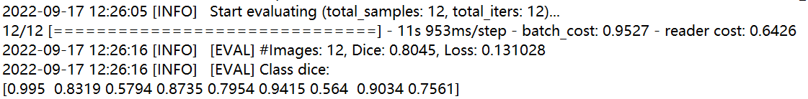

# SwinUNet: Swin-Unet: Unet-like Pure Transformer for Medical Image Segmentation（SwinUNet 基于Paddle复现）

## 1.简介

医学图像分割是开发医疗保健系统的必要前提，尤其是疾病诊断和治疗规划。在各种医学图像分割任务中，u形结构（也称为UNet）已成为事实上的标准，并取得了巨大成功。然而，由于卷积运算的内在局部性，U-Net通常在显式建模长期依赖性时表现出局限性。设计用于seq2seq预测的Transformer已成为具有固有全局自我注意机制的替代架构，但由于低层次细节不足，可能导致有限的定位能力。在本文中，作者提出了Swinunet作为医学图像分割的一种强有力的替代方法，它使用SwinTransformer进行编码解码，结构形式类似UNet，解码器对编码特征进行上采样，然后将其与高分辨率NN特征映射相结合，以实现精确定位。作者认为，Transformer可以作为医学图像分割任务的强编码器，与U-Net相结合，通过恢复局部空间信息来增强细节。SwinUNet在不同的医学应用中，包括多器官分割和心脏分割，实现了优于各种竞争方法的性能。

## 2.复现精度

在Synapse数据集上的测试效果如下表。

| NetWork  | epochs | opt | batch_size | dataset | MDICE  |
| -------- | ------ | --- | ---------- | ------- | ------ |
| SwinUNet | 150    | SGD | 24         | Synapse | 80.14% |

## 3.数据集

Synapse数据集下载地址:
使用作者提供的数据集，由于作者不允许分发。这里提供转换后的png图片数据。如有原数据需要可联系我。

[https://aistudio.baidu.com/aistudio/datasetdetail/165793](https://aistudio.baidu.com/aistudio/datasetdetail/165793)

## 4.环境依赖

PaddlePaddle == 2.3.1

## 5.快速开始

首先clone本项目：

```shell
git clone https://github.com/marshall-dteach/SwinUNet.git
```

### 训练：

下载数据集解压后，首先将数据集链接到项目的data目录下。

```shell
cd /home/aistudio/data
unzip data165793/Synapse_npy.zip
cd /home/aistudio/SwinUNet
mkdir data
ln -s /home/aistudio/data/Synapse_npy data/Synapse_npy
mv /home/aistudio/data/data169157/pretrained.pdparams /home/aistudio/SwinUNet/pretrained
```

然后安装依赖包。

```shell
cd /home/aistudio/SwinUNet
pip install -r requirements.txt
pip install paddleseg
```

最后启动训练脚本。

```shell
cd /home/aistudio/SwinUNet
python -u train.py --config configs/swinunet/swinunet_synapse_1_224_224_14k_1e-2.yml --do_eval --save_interval 1000 \
--has_dataset_json False --is_save_data False --num_workers 4 --log_iters 100 --seed 998
```

### 测试：

使用最优模型进行评估.

```shell
cd /home/aistudio/SwinUNet
python -u test.py --config configs/swinunet/swinunet_synapse_1_224_224_14k_1e-2.yml \
--model_path output/best_model/model.pdparams --has_dataset_json False --is_save_data False
```

config: 配置文件路径

model_path: 预训练模型路径

### TIPC基础链条测试

该部分依赖auto_log，需要进行安装，安装方式如下：

auto_log的详细介绍参考[https://github.com/LDOUBLEV/AutoLog](https://github.com/LDOUBLEV/AutoLog)。

```shell
git clone https://gitee.com/Double_V/AutoLog
cd AutoLog/
pip3 install -r requirements.txt
python3 setup.py bdist_wheel
pip3 install ./dist/auto_log-1.2.0-py3-none-any.whl
```

```shell
bash test_tipc/prepare.sh test_tipc/configs/transunet/train_infer_python.txt "lite_train_lite_infer"

bash test_tipc/test_train_inference_python.sh test_tipc/configs/transunet/train_infer_python.txt "lite_train_lite_infer"
```

测试结果如截图所示：



## 6.代码结构与详细说明

```shell
MedicalSeg
├── configs         # 关于训练的配置，每个数据集的配置在一个文件夹中。基于数据和模型的配置都可以在这里修改
├── data            # 存储预处理前后的数据
├── deploy          # 部署相关的文档和脚本
├── medicalseg  
│   ├── core        # 训练和评估的代码
│   ├── datasets  
│   ├── models  
│   ├── transforms  # 在线变换的模块化代码
│   └── utils  
├── export.py
├── run-unet.sh     # 包含从训练到部署的脚本
├── tools           # 数据预处理文件夹，包含数据获取，预处理，以及数据集切分
├── train.py
├── val.py
└── visualize.ipynb # 用于进行 3D 可视化
```

## 7.模型信息

| 信息     | 描述                |
| -------- | ------------------- |
| 模型名称 | SwinUNet            |
| 框架版本 | PaddlePaddle==2.3.1 |
| 应用场景 | 医疗图像分割        |
